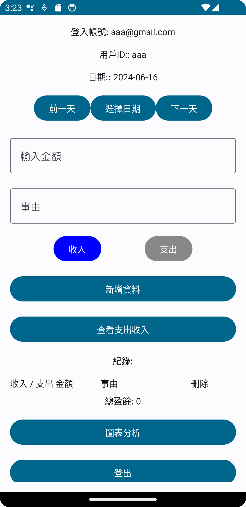

# 1122 Android期末專案
## Simple Accounting

* 功能
*   *  登入夜面
輸入帳號密碼後能登入

按下切換註冊能切換至註冊頁面

*   *   主葉面

最上面為登入帳號資訊 <\br>
帳號資訊底下為日期選擇 <\br>
中間選擇日期會跳出月曆可以選擇日期 <\br>

中間輸入金額及事由後底下可以選擇支出還是收入，藍色為選擇到的類型 <\br>
按下新增資料後會顯示在底下

按下查看收入支出可以查看當月的紀錄總和

按下圖表紀錄可以以折線圖查看當月紀錄

最底下可以登出帳號

---

|  | 工作 |
| ---- | ---- |
| 林柏安 | 主頁面(含Firebase) |
| 楊乃諺 | 多語言、介面美化 |
| 洪銘均 | 登入頁面(含Firebase)、圖表化|
